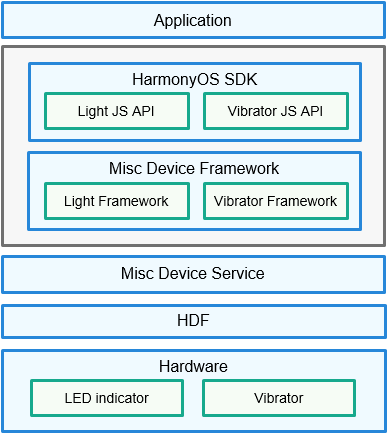

# Misc Device<a name="EN-US_TOPIC_0000001148523206"></a>

-   [Introduction](#section11660541593)
-   [Directory Structure](#section44981327519)
-   [Constraints](#section98068674513)
-   [Usage](#section1581412211528)
    -   [Available APIs](#section15684191115524)
    -   [How to Use](#section79302049192310)

-   [Repositories Involved](#section96071132185310)

## Introduction<a name="section11660541593"></a>

Misc devices, including vibrators and LED indicators, are used to send signals externally. You can call APIs to control the vibration of vibrators and lighting-on and lighting-off of LED indicators.

**Figure  1**  Misc device architecture<a name="fig4460722185514"></a>  




## Directory Structure<a name="section44981327519"></a>

```
/base/sensors/miscdevice
├── frameworks                 # Framework code
│   └── native                 # Native methods for the client to connect to services
├── interfaces                 # External APIs
│   ├── native                 # Native implementation
│   └── plugin                 # JS APIs
├── sa_profile                 # Configuration file of system ability names and dynamic libraries
├── services                   # Code of services
│   └── miscdevice_service     # Misc device service, which is used to control the vibration of vibrators and lighting-on and lighting-off of LED lights
└── utils                      # Common code, including permissions and communication capabilities
```

## Constraints<a name="section98068674513"></a>

-   The APIs are valid only when your hardware is equipped with the required misc devices.
-   To use vibrators, you need to request the required permissions.

    **Table  1**  Permissions required by misc devices

    <a name="table1379101653916"></a>
    <table><thead align="left"><tr id="row137911161397"><th class="cellrowborder" valign="top" width="15.728427157284273%" id="mcps1.2.5.1.1"><p id="p15138132134118"><a name="p15138132134118"></a><a name="p15138132134118"></a>Misc Device</p>
    </th>
    <th class="cellrowborder" valign="top" width="28.537146285371463%" id="mcps1.2.5.1.2"><p id="p2798169398"><a name="p2798169398"></a><a name="p2798169398"></a>Permission Name</p>
    </th>
    <th class="cellrowborder" valign="top" width="18.168183181681833%" id="mcps1.2.5.1.3"><p id="p14791716163914"><a name="p14791716163914"></a><a name="p14791716163914"></a>Sensitivity</p>
    </th>
    <th class="cellrowborder" valign="top" width="37.56624337566243%" id="mcps1.2.5.1.4"><p id="p379171633919"><a name="p379171633919"></a><a name="p379171633919"></a>Permission Description</p>
    </th>
    </tr>
    </thead>
    <tbody><tr id="row12791216173912"><td class="cellrowborder" valign="top" width="15.728427157284273%" headers="mcps1.2.5.1.1 "><p id="p18658132191310"><a name="p18658132191310"></a><a name="p18658132191310"></a>Vibrator</p>
    </td>
    <td class="cellrowborder" valign="top" width="28.537146285371463%" headers="mcps1.2.5.1.2 "><p id="p8826341131218"><a name="p8826341131218"></a><a name="p8826341131218"></a>ohos.permission.VIBRATE</p>
    </td>
    <td class="cellrowborder" valign="top" width="18.168183181681833%" headers="mcps1.2.5.1.3 "><p id="p207991683914"><a name="p207991683914"></a><a name="p207991683914"></a>system_grant</p>
    </td>
    <td class="cellrowborder" valign="top" width="37.56624337566243%" headers="mcps1.2.5.1.4 "><p id="p118061614399"><a name="p118061614399"></a><a name="p118061614399"></a>Allows an application to use the vibrator.</p>
    </td>
    </tr>
    </tbody>
    </table>


## Usage<a name="section1581412211528"></a>

This section describes the features and usage of the vibrator APIs.

### Available APIs<a name="section15684191115524"></a>

The APIs provided for the vibrator are used to trigger and stop vibration. The following table describes these APIs.

**Table  2**  JS APIs for the vibrator

<a name="table1738121244713"></a>
<table><thead align="left"><tr id="row4381111254710"><th class="cellrowborder" valign="top" width="31.209999999999997%" id="mcps1.2.3.1.1"><p id="p1738116127470"><a name="p1738116127470"></a><a name="p1738116127470"></a>API</p>
</th>
<th class="cellrowborder" valign="top" width="68.78999999999999%" id="mcps1.2.3.1.2"><p id="p10381161224717"><a name="p10381161224717"></a><a name="p10381161224717"></a>Description</p>
</th>
</tr>
</thead>
<tbody><tr id="row18381121274715"><td class="cellrowborder" valign="top" width="31.209999999999997%" headers="mcps1.2.3.1.1 "><p id="p15297217910"><a name="p15297217910"></a><a name="p15297217910"></a>vibrate(duration: number, callback?: AsyncCallback&lt;void&gt;)</p>
</td>
<td class="cellrowborder" valign="top" width="68.78999999999999%" headers="mcps1.2.3.1.2 "><p id="p143812128476"><a name="p143812128476"></a><a name="p143812128476"></a>Triggers vibration based on the duration specified by <strong id="b137434619532"><a name="b137434619532"></a><a name="b137434619532"></a>duration</strong>. This API uses a callback to indicate whether the vibration is triggered successfully.</p>
</td>
</tr>
<tr id="row29912332312"><td class="cellrowborder" valign="top" width="31.209999999999997%" headers="mcps1.2.3.1.1 "><p id="p599153172316"><a name="p599153172316"></a><a name="p599153172316"></a>vibrate(duration: number): Promise&lt;void&gt;</p>
</td>
<td class="cellrowborder" valign="top" width="68.78999999999999%" headers="mcps1.2.3.1.2 "><p id="p1099114392316"><a name="p1099114392316"></a><a name="p1099114392316"></a>Triggers vibration based on the duration specified by <strong id="b0770125017531"><a name="b0770125017531"></a><a name="b0770125017531"></a>duration</strong>. This API uses a promise to indicate whether the vibration is triggered successfully.</p>
</td>
</tr>
<tr id="row1938113125470"><td class="cellrowborder" valign="top" width="31.209999999999997%" headers="mcps1.2.3.1.1 "><p id="p13811121475"><a name="p13811121475"></a><a name="p13811121475"></a>vibrate(effectId: EffectId, callback?: AsyncCallback&lt;void&gt;)</p>
</td>
<td class="cellrowborder" valign="top" width="68.78999999999999%" headers="mcps1.2.3.1.2 "><p id="p538120127476"><a name="p538120127476"></a><a name="p538120127476"></a>Triggers vibration based on the vibration effect specified by <strong id="b1757143012530"><a name="b1757143012530"></a><a name="b1757143012530"></a>effectId</strong>. This API uses a callback to indicate whether the vibration is triggered successfully.</p>
</td>
</tr>
<tr id="row15109898239"><td class="cellrowborder" valign="top" width="31.209999999999997%" headers="mcps1.2.3.1.1 "><p id="p181101197234"><a name="p181101197234"></a><a name="p181101197234"></a>vibrate(effectId: EffectId): Promise&lt;void&gt;</p>
</td>
<td class="cellrowborder" valign="top" width="68.78999999999999%" headers="mcps1.2.3.1.2 "><p id="p12110159112310"><a name="p12110159112310"></a><a name="p12110159112310"></a>Triggers vibration based on the vibration effect specified by <strong id="b680313655410"><a name="b680313655410"></a><a name="b680313655410"></a>effectId</strong>. This API uses a promise to indicate whether the vibration is triggered successfully.</p>
</td>
</tr>
<tr id="row10382181218477"><td class="cellrowborder" valign="top" width="31.209999999999997%" headers="mcps1.2.3.1.1 "><p id="p764313511343"><a name="p764313511343"></a><a name="p764313511343"></a>stop(stopMode: VibratorStopMode, callback?: AsyncCallback&lt;void&gt;)</p>
</td>
<td class="cellrowborder" valign="top" width="68.78999999999999%" headers="mcps1.2.3.1.2 "><p id="p1738291234712"><a name="p1738291234712"></a><a name="p1738291234712"></a>Stops vibration based on the mode specified by <strong id="b1019916113564"><a name="b1019916113564"></a><a name="b1019916113564"></a>stopMode</strong>. There are two modes: <strong id="b1784893665611"><a name="b1784893665611"></a><a name="b1784893665611"></a>VIBRATOR_STOP_MODE_TIME</strong> and <strong id="b157644016560"><a name="b157644016560"></a><a name="b157644016560"></a>VIBRATOR_STOP_MODE_PRESET</strong>, which are used to stop vibration triggered by <strong id="b1217141320585"><a name="b1217141320585"></a><a name="b1217141320585"></a>duration</strong> and <strong id="b1639019514578"><a name="b1639019514578"></a><a name="b1639019514578"></a>effectId</strong>, respectively. This API uses a callback to indicate whether the vibration is stopped successfully.</p>
</td>
</tr>
<tr id="row2087541618235"><td class="cellrowborder" valign="top" width="31.209999999999997%" headers="mcps1.2.3.1.1 "><p id="p13875201620231"><a name="p13875201620231"></a><a name="p13875201620231"></a>stop(stopMode: VibratorStopMode): Promise&lt;void&gt;</p>
</td>
<td class="cellrowborder" valign="top" width="68.78999999999999%" headers="mcps1.2.3.1.2 "><p id="p14875916142317"><a name="p14875916142317"></a><a name="p14875916142317"></a>Stops vibration based on the mode specified by <strong id="b128871517589"><a name="b128871517589"></a><a name="b128871517589"></a>stopMode</strong>. There are two modes: <strong id="b16566172217582"><a name="b16566172217582"></a><a name="b16566172217582"></a>VIBRATOR_STOP_MODE_TIME</strong> and <strong id="b1757216228581"><a name="b1757216228581"></a><a name="b1757216228581"></a>VIBRATOR_STOP_MODE_PRESET</strong>, which are used to stop vibration triggered by <strong id="b257214227586"><a name="b257214227586"></a><a name="b257214227586"></a>duration</strong> and <strong id="b457362275812"><a name="b457362275812"></a><a name="b457362275812"></a>effectId</strong>, respectively. This API uses a promise to indicate whether the vibration is stopped successfully.</p>
</td>
</tr>
</tbody>
</table>

### How to Use<a name="section79302049192310"></a>

1.  Import the  **vibrate**  package.
2.  Trigger vibration with a specific duration.
3.  Stop vibration that is triggered with a specific duration.
4.  Trigger vibration with a specific effect.
5.  Stop vibration that is triggered with a specific effect.

The following sample code provides a complete process of using the vibrator APIs:

```
//Step 1 Import the vibrate package.
import vibrate from '@ohos.vibrate';
export default {
    onCreate() {
        console.info('MiscdeviceJsAPI AceApplication onCreate');
        // Step 2 Trigger vibration with a specific duration.
        vibrate.vibrate(100, function(error) {
             if (error) {
                 console.error("Failed to trigger vibration. Error code: " + error.code + "; message: " + error.message);
                 return;
             }
             console.info("Succeeded in triggering vibration.");
        });
        // Step 3 Stop vibration that is triggered with a specific duration.
        vibrate.stop(vibrate.VibratorStopMode.VIBRATOR_STOP_MODE_TIME, function(error) {
             if (error) {
                 console.error("Failed to stop vibration. Error code: " + error.code + "; message: " + error.message);
                 return;
             }
             console.info("Succeeded in stopping vibration.");
        });
        // Step 4 Trigger vibration based on with a specific effect.
        vibrate.vibrate(vibrate.EffectId.EFFECT_CLOCK_TIMER, function(error) {
             if (error) {
                 console.error("Failed to trigger vibration. Error code: " + error.code + "; message: " + error.message);
                 return;
             }
             console.info("Succeeded in triggering vibration.");
        });
        // Step 54 Stop vibration that is triggered with a specific effect.
        vibrate.stop(vibrate.VibratorStopMode.VIBRATOR_STOP_MODE_PRESET, function(error) {
             if (error) {
                 console.error("Failed to stop vibration. Error code: " + error.code + "; message: " + error.message);
                 return;
             }
             console.info("Succeeded in stopping vibration.");
        });
    }
    onDestroy() {
        console.info('AceApplication onDestroy');
    }
}
```

## Repositories Involved<a name="section96071132185310"></a>

Pan-sensor subsystem

[sensors\_sensor](https://gitee.com/openharmony/sensors_sensor)

**sensors\_miscdevice**

